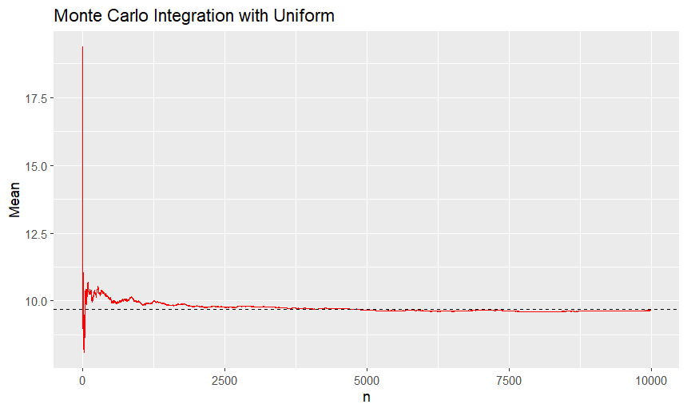
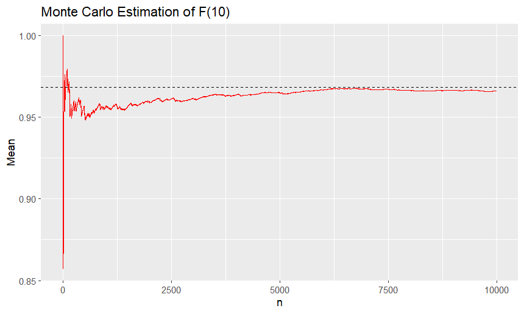
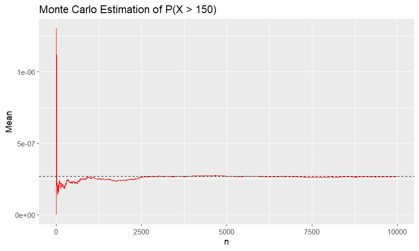

# Monte Carlo Estimation of Integrals & Probabilities (R)
This repository contains an academic project completed as part of the course **Computational Statistics**.
## 📖 Overview

This project focuses on the estimation of integrals and probabilities through the application of Monte Carlo methods, including Monte Carlo integration and importance sampling.

All simulations are performed using a sample size of $n=10,000$.

---

## 📃 Contents
The project consists of four main computational experiments:

### 1. Monte Carlo Integration

We estimate the integral:

$$\displaystyle I=\int_{0}^{10} \left\(\cos(x)-\sin(x)\right\)^2 dx$$

using a simulated random sample from the $\text{Uniform}(0,10)$ distribution.

The estimator is:

$$\displaystyle \hat{I}_n = \frac{10}{n} \sum_{i=1}^n h(U_i)$$

where:  

- $h(x) = \left\( \cos(x) - \sin(x) \right\)^2$
- $U_i \sim \text{Uniform}(0,10), i=1,2,\dots,n$ are i.i.d. random variables

We visualize the convergence of the estimator to the true value of the integral, computed using numerical integration:



### 2. CDF Estimation (Cauchy Distribution) 

We estimate the cumulative distribution function of the $\text{Cauchy}(0,1)$ distribution:

$$F(x)=P(X \le x), X\sim \text{Cauchy}(0,1)$$

for selected values:

- $x=-1$
- $x=0$
- $x=10$

The estimator is the empirical cumulative distribution function: 

$$\displaystyle \hat{F}_n(x)=\frac{1}{n}\sum_{i=1}^{n}\mathbf{1}_{\left\\{X_i\le x\right\\}}$$

where $X_i\sim \text{Cauchy}(0,1), i=1,2,\dots,n$ are i.i.d. random variables.



### 3. Probability Estimation

We estimate the probabilities:

- $P(X < Y)$
- $P(X + Y \ge 5)$

where $X\sim\text{Gamma}(2,1)$ and $Y\sim\text{Geom}(0.4)$ are independent random variables.

The estimators are respectively:

- $\frac{1}{n} \sum_{i=1}^{n} E\left\[F_X(Y_i)\right\]$
- $1-\frac{1}{n} \sum_{i=1}^{n} E\left\[F_X(5-Y_i)\right\]$

where $Y_i\sim\text{Geom}(0.4), i=1,2,\dots,n$ are i.i.d. random variables.

### 4. Importance Sampling

We estimate the probability 

$$P(X>150), X\sim\text{LogNormal}(0,1)$$

using importance sampling, simulating from the $\text{Exp}(\theta = 100)$ distribution, where $\theta$ is a scale parameter.

The estimator is:

$$\displaystyle \frac{1}{n}\sum_{i=1}^{n}\left\[\mathbf{1}_{\\{Y_i>150\\}}\frac{f(Y_i)}{g(Y_i)}\right\]$$ 

where:

- $f$ is the probability density function of the $\text{LogNormal}(0,1)$ distribution
- $g$ is the probability density function of the $\text{Exp}(\theta = 100)$ distribution (the so-called importance function)
- $Y_i \sim \text{Exp}(\theta = 100), i=1,2,\dots,n$ are i.i.d. random variables



---

## ⚙️ Tools and Technologies Used
- R
- RStudio
- ggplot2

---

## ▶️ Running the Code

1. Clone or download this repository.

2. Open `MonteCarloEstimation.Rproj` in RStudio.

3. Install the required package:

```r
install.packages("ggplot2")
```
4. Run the script:

```r
source("monte_carlo_estimation.R") 
```

---

## ✍️ Notes
- All experiments use $n=10,000$ simulations for consistency.
- Plots illustrate the convergence of the estimators as the sample size increases.
- Randomness may be lead to slight variations in numerical results.

---

## 👨‍💻 Author
**Marios Giannakopoulos**

Department of Mathematics

National and Kapodistrian University of Athens
